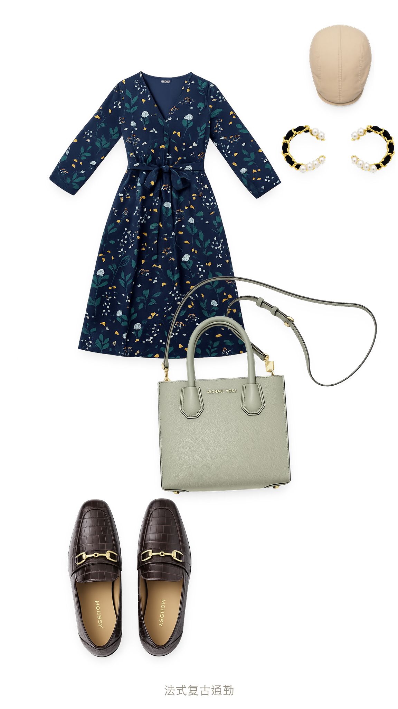

# 我的衣橱 · My Wardrobe

> 拍照建档 · AI 美化去皱 · 勾选搭配 · 一键生成小红书风搭配卡
>
> 一个跨平台的 Agent Skill,适配 **Codex / Claude Code / Kimi** 等支持 SKILL.md 的 AI 编程/办公助手。

[English README](README_EN.md)


📹 完整演示视频:[docs/demo.mp4](docs/demo.mp4)

## 它能做什么

1. **拍照录入** —— 把衣服、裤子、首饰、鞋、帽、包等单品照片发给 AI,自动识别品类并抠图建档
2. **AI 美化** —— 实拍褶皱自动抚平,生成透明底、电商级整洁单品图(保留印花、领口、五金细节)
3. **衣橱管理** —— 全部单品按槽位(上装/下装/连衣裙/鞋/包/帽/首饰…)分类,识别错了可手动调类
4. **勾选搭配** —— 想搭哪几件勾哪几件,也可以让 AI 按配色/风格/场合推荐
5. **生成搭配卡** —— 默认输出小红书 9:16 竖版杂志拼贴卡(柔和投影 + 微旋转 + 层叠构图),也有经典 3:4 带标签版,直发小红书/公众号

## 示例成品



## 安装

把本仓库整个目录放进你所用工具的 skills 目录,重命名为 `my-wardrobe`:

| 工具 | 放置位置 |
|------|----------|
| Claude Code | `~/.claude/skills/my-wardrobe/` |
| Codex | `~/.codex/skills/my-wardrobe/` |
| Kimi | 通过技能管理导入,或放入技能目录 |

放好后对 AI 说「拍下这件衣服,放进我的衣橱」「帮我从衣橱里搭一套通勤装」即可触发。

> 目录名与 `SKILL.md` 里的 `name: my-wardrobe` 保持一致即可;中文名「我的衣橱」同时写进了触发词。

## 目录结构

```
my-wardrobe/
├── SKILL.md                     # 技能入口:工作流与规则
├── scripts/
│   ├── remove_bg.py             # 本地抠图(rembg)
│   ├── beautify_item.py         # 本地去皱兜底(OpenCV 频率分离)
│   ├── compose_card.py          # 经典 3:4 带标签搭配卡
│   └── compose_card_xhs.py      # 小红书 9:16 杂志拼贴卡(默认)
├── references/
│   ├── categories.md            # 单品槽位/分类与搭配规则
│   └── style-guide.md           # 两版卡片的视觉规范 + 水印擦除规则
├── assets/
│   ├── reference-xhs-card.jpg   # 小红书版式基准
│   └── reference-card.jpeg      # 经典版式基准
└── docs/                        # 演示视频、GIF、示例成品
```

## 依赖

- 必需:`python3` + `Pillow`(合成搭配卡)
- 可选:`rembg`(本地抠图)、`opencv-python-headless`(本地去皱)
- AI 抠图/美化优先使用各平台自带的图像生成能力,本地脚本仅作兜底

## 使用流程速览

```bash
# 1. 录入:把单品照片发给 AI,或手动抠图
python3 scripts/remove_bg.py 照片.jpg -d items/

# 2. 美化(无 AI 重绘能力时的本地兜底)
python3 scripts/beautify_item.py items/item1.png -o items/item1.png

# 3. 生成小红书风搭配卡
python3 scripts/compose_card_xhs.py spec.json -o outfit.png
```

`spec.json` 示例:

```json
{
  "title": "法式复古通勤",
  "items": [
    {"image": "items/item15.png", "id": "item15", "slot": "dress"},
    {"image": "items/item40.png", "id": "item40", "slot": "hat"},
    {"image": "items/item20.png", "id": "item20", "slot": "shoes"},
    {"image": "items/item37.png", "id": "item37", "slot": "bag"}
  ]
}
```

槽位可选:`dress / top / outerwear / bottom / shoes / bag / hat / jewelry / scarf / socks / accessory`。

## License

MIT
